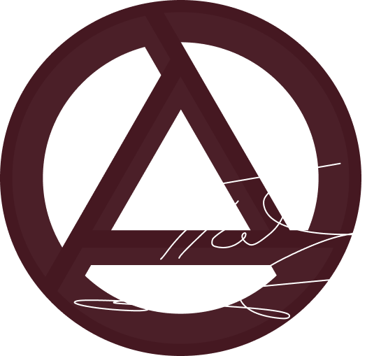

<p style="text-align: left; margin: 0;">
  
</p>

# Aluminium 🎮

Lightweight and sometimes unsafe, pure-Rust, graphics library for convenient work with Vulkan Api


[](https://github.com/olejaaaaaaaa/aluminium/actions/workflows/ci.yaml)
[](https://hitsofcode.com/github/olejaaaaaaaa/aluminium/view)

# Warning
This library is currently unstable and its API is subject to frequent changes

# Getting Started
You can run the main example
```bash
git clone https://github.com/olejaaaaaaaa/aluminium
cargo run -p simple
```
# Usage
The library's primary goal is data visualization with reasonably high performance, but it does not provide loaders for glTF/OBJ/PNG formats.

# Minimal required extensions:
Due to the wide variety of hardware, I've chosen to support only the common subset of features available on both Pс and Mobile devices

    - VK_KHR_swapchain
    - VK_EXT_descriptor_indexing
    - VK_KHR_driver_properties
    - VK_KHR_synchronization2
    - VK_KHR_timeline_semaphore
    - VK_KHR_get_physical_device_properties2

# Features:
* VMA Allocator integration
* Simple FrameGraph

# Supported Platforms
* Windows only

# Credits
This library is heavily inspired by [Kajiya](https://github.com/EmbarkStudios/kajiya). I probably wouldn't have created it if that project didn't exist.

# Known issues:
* Not all Vulkan resources are cleared
